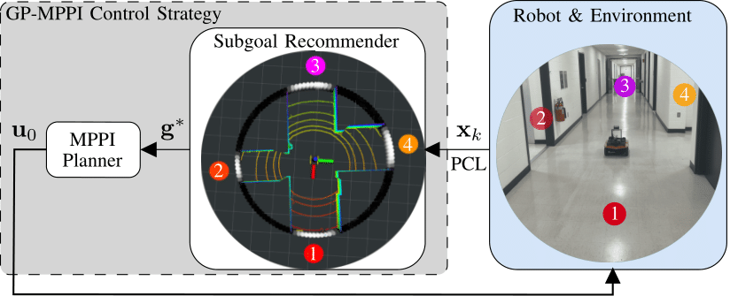

# GP-MPPI

This repository contains the ROS implementation of the GP-MPPI control strategy, an online learning-based control strategy that integrates the state-of-the-art sampling-based Model Predictive Path Integral [(MPPI)](https://arc.aiaa.org/doi/pdf/10.2514/1.G001921) controller with a local perception model based on Sparse Gaussian Process (SGP).

The key idea is to leverage the learning capability of SGP to construct a variance (uncertainty) surface, enabling the robot to learn about the navigable space surrounding it, identify a set of suggested subgoals, and ultimately recommend the optimal subgoal that minimizes a predefined cost function for the local MPPI planner. MPPI then computes the optimal control sequence that satisfies the robot and collision avoidance constraints. This approach eliminates the need for a global map of the environment or an offline training process.

## Media:
**Video**: https://youtu.be/et9t8X1wHKI OR https://youtu.be/yDBaRLvAejk.

## ROS Packages:

The entire project will be uploaded soon; however, we are currently referring to our related repositories for the baselines [(namely, MPPI and log-MPPI)](https://github.com/IhabMohamed/log-MPPI_ros) and [GP perception model](https://github.com/mahmoud-a-ali/vsgp_pcl).

### Primary code maintainer:
Ihab S. Mohamed and Mahmoud Ali (e-mail: {mohamedi, alimaa}@iu.edu)\
Vehicle Autonomy and Intelligence Lab ([VAIL](https://vail.sice.indiana.edu/))\
Indiana University - Bloomington, USA

